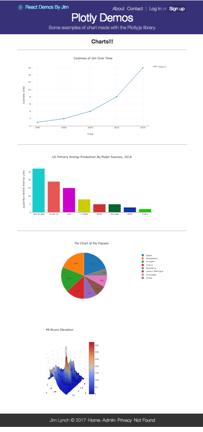

# Jim's React Isomorphic Plotly Demos

This is a nice little example of an Isomorphic React project that displays a few charts created with the Plotly.js library.

Although isomorphic react is really cool because when deploying the app you just run `node server`, the unfortunate side effect is that it's difficult to host the site with free services like github's gh-pages. So, I don't have a nice live demo for you, but here's a cool screenshot.

## Usage

### Requirements
Mac OS X, Windows, or Linux
Yarn package + Node.js v6.5 or newer
Text editor or IDE pre-configured with React/JSX/Flow/ESlint (learn more)

Run yarn install
This will install both run-time project dependencies and developer tools listed in package.json file.

3. Run yarn start
This command will build the app from the source files (/src) into the output /build folder. As soon as the initial build completes, it will start the Node.js server (node build/server.js) and Browsersync with HMR on top of it.

http://localhost:3000/ — Node.js server (build/server.js) with Browsersync and HMR enabled
http://localhost:3000/graphql — GraphQL server and IDE
http://localhost:3001/ — Browsersync control panel (UI)

Now you can open your web app in a browser, on mobile devices and start hacking. Whenever you modify any of the source files inside the /src folder, the module bundler (Webpack) will recompile the app on the fly and refresh all the connected browsers.

browsersync

Note that the yarn start command launches the app in development mode, the compiled output files are not optimized and minimized in this case. You can use --release command line argument to check how your app works in release (production) mode:

$ yarn start -- --release
NOTE: double dashes are required

How to Build, Test, Deploy
If you need just to build the app (without running a dev server), simply run:

$ yarn run build
or, for a production build:

$ yarn run build -- --release
or, for a production docker build:

$ yarn run build -- --release --docker
NOTE: double dashes are required

After running this command, the /build folder will contain the compiled version of the app. For example, you can launch Node.js server normally by running node build/server.js.

To check the source code for syntax errors and potential issues run:

$ yarn run lint
To launch unit tests:

$ yarn run test          # Run unit tests with Mocha
$ yarn run test:watch    # Launch unit test runner and start watching for changes
By default, Mocha test runner is looking for test files matching the src/**/*.test.js pattern. Take a look at src/components/Layout/Layout.test.js as an example.

To deploy the app, run:

$ yarn run deploy
The deployment script tools/deploy.js is configured to push the contents of the /build folder to a remote server via Git. You can easily deploy your app to Azure Web Apps, or Heroku this way. Both will execute yarn install --production upon receiving new files from you. Note, you should only deploy the contents of the /build folder to a remote server.

How to Update
If you need to keep your project up to date with the recent changes made to RSK, you can always fetch and merge them from this repo back into your own project by running:

$ git checkout master
$ git fetch react-starter-kit
$ git merge react-starter-kit/master
$ yarn install

## Special Thanks
Thanks to David Doherty for gettting me into the Plot.ly library. :)